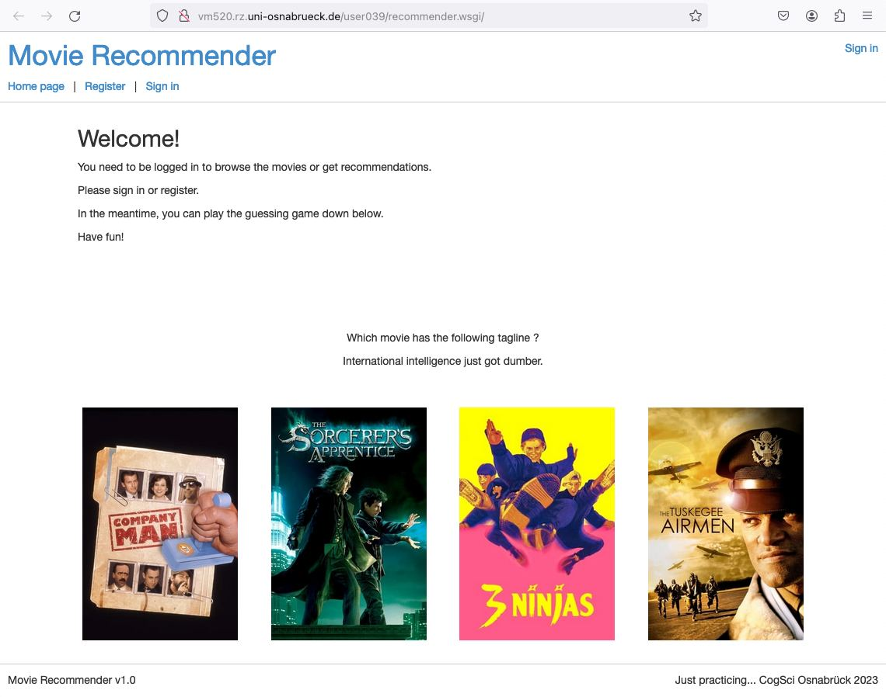

# Simple movie recommender

This is a simple web application for users to sign up, rate movies and generate movie recommendations. The app is created in python using <a href="https://flask.palletsprojects.com/en/3.0.x/">flask</a> and <a href="https://flask-sqlalchemy.palletsprojects.com/en/2.x/quickstart/">SQLAlchemy </a>for the database. 

## How-To 
1. create and activate a virtual environment  
2. install all dependencies in requirements.txt
3. build the sqlite database from csv files by 
	"flask --app recommender.py initdb"	
4. start web application
	* manually by
		"flask --app recommender.py run"
	* or make use of website.wsgi
		(avoid Firefox, Safari browser works best)

## recommender.py
This file handles configuration, launching and initializing the flask app. 
It contains routes/views for:  

1. logged in vs. not logged in
2. homepage with instructions and simple guessing game
3. profil page for managing data and generating recommendations
4. interactive listing of movies and ratings  
5. recommendations based on own ratings, random or popular recommendations

## models.py
This file contains declarations of custome SQLAlchemy models, used to create our database in flask.  

## read\_data.py
This file contains functions for reading-in the csv data and building the databases. 

## create\_recommendations.py
Contains matrix factorization using MSE and gradient descent for movie recommendations.

## scrape\_movie\_data\_from\_tmdb.py
File to get movie data, e.g summary, poster etc. based on csv data. Can either scrape tmdb.org or use their API key.

## /templates
Contains all views as .html used by recommender.py.

## /static
Contains javascript functions and images

## /data 
Contains the Movie Lens dataset, a description and the embeddings for Matrix Factorisation

### Screenshots of running application 
 

Homepage: 
 

 

User profile: 
 

 

Recommendations page: 
 

 